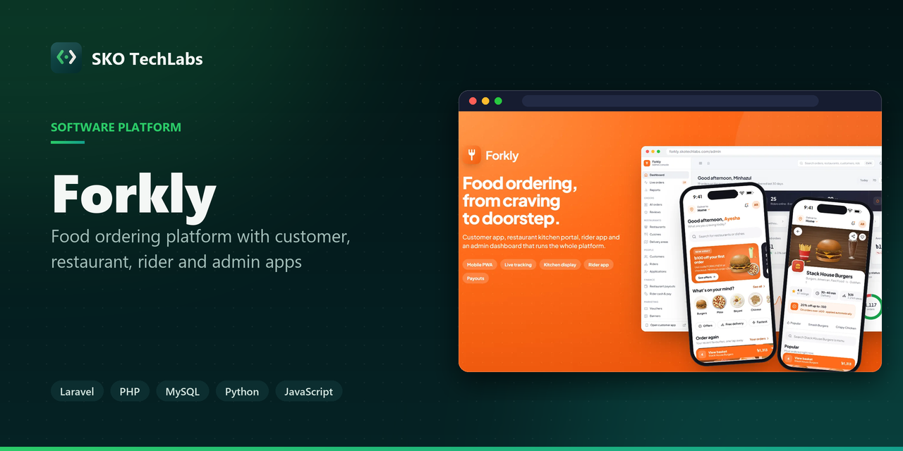
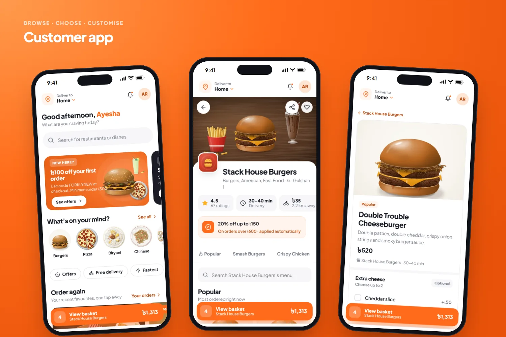
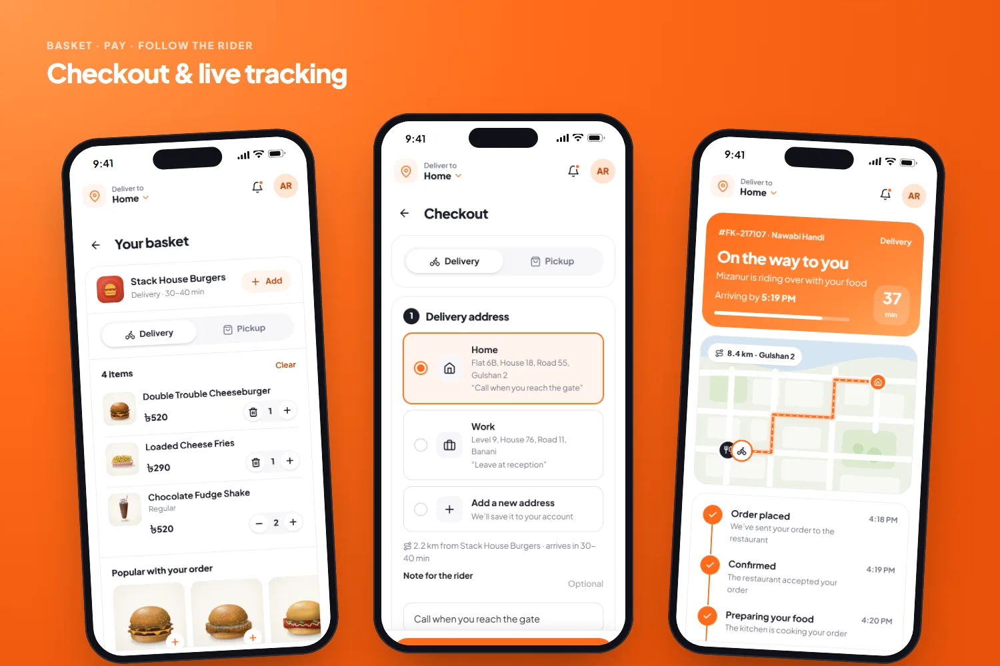
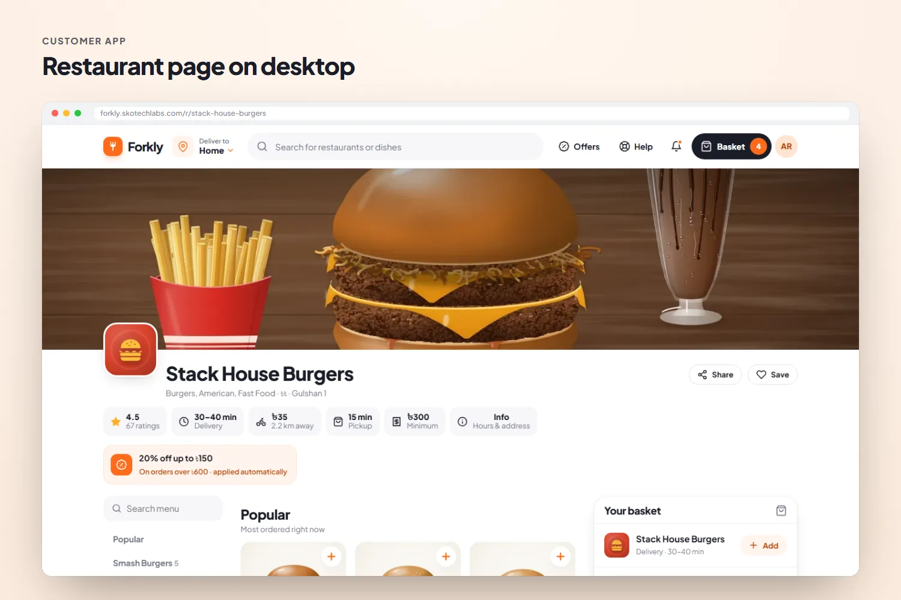
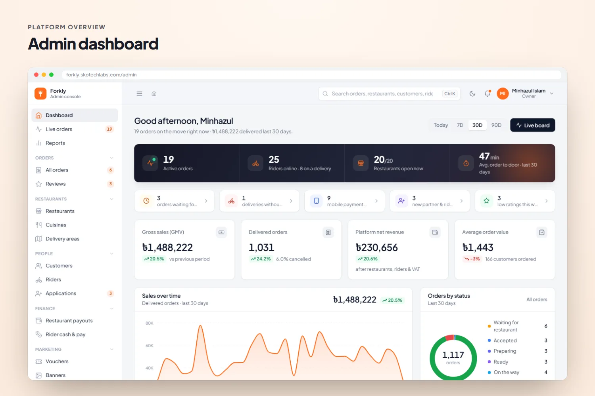
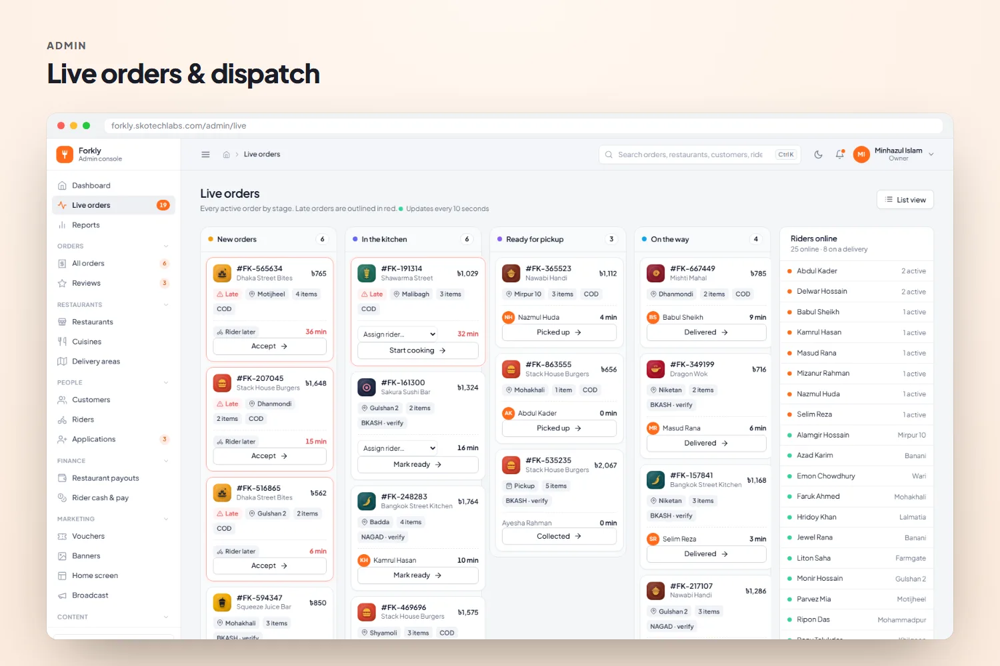
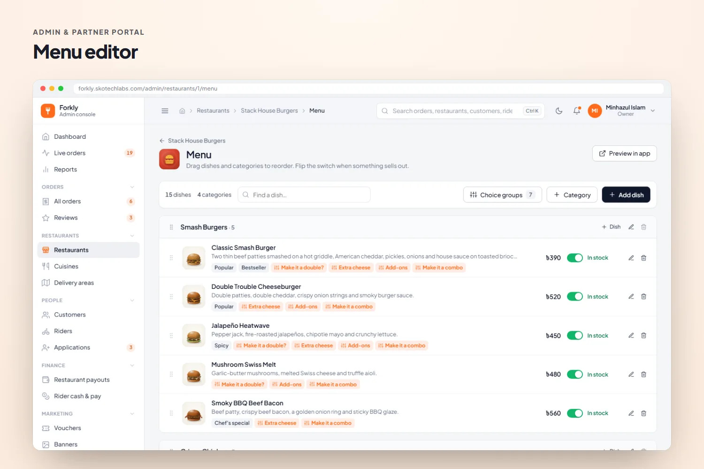
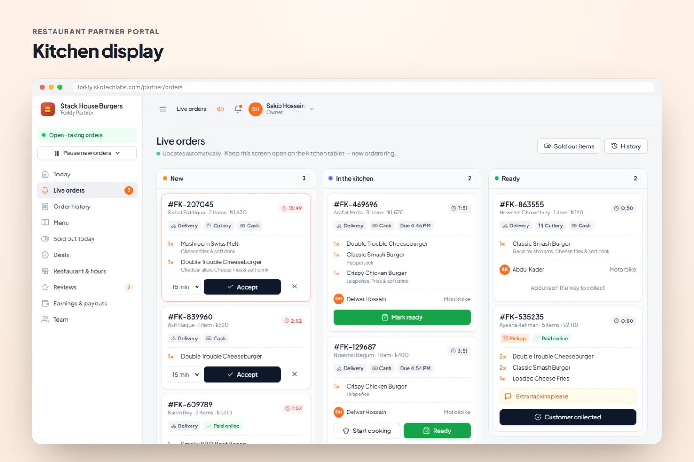
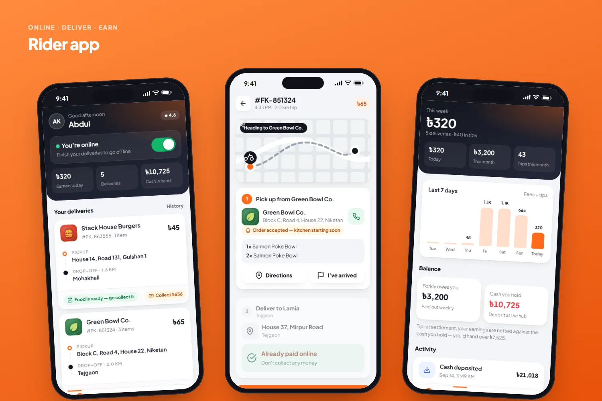
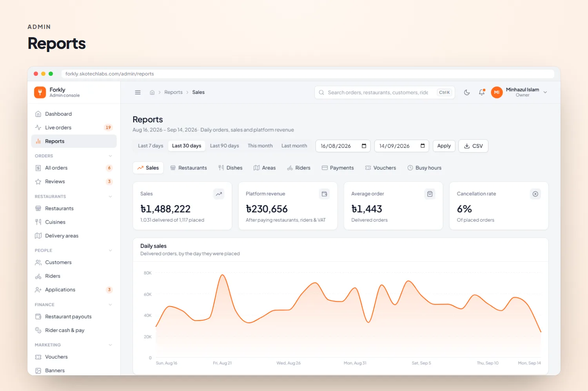

<h3>Food ordering platform with customer, restaurant, rider and admin apps</h3>

A complete food delivery platform for Dhaka: a mobile-first ordering app with live tracking, a kitchen display for restaurants, a rider app and an admin dashboard that manages every restaurant, menu, fee, rider and payout.

   

<a href="https://forkly.skotechlabs.com"><b>Live Demo</b></a> &nbsp;·&nbsp; <a href="https://skotechlabs.com/projects/forkly-food-ordering-platform"><b>Case Study</b></a> &nbsp;·&nbsp; <a href="https://skotechlabs.com/contact"><b>Request a Demo</b></a> &nbsp;·&nbsp; <a href="https://github.com/skotechlabs"><b>All Products</b></a>

---

## Overview

Forkly is a multi-restaurant food ordering platform in the style of the big delivery apps, built for Dhaka. Customers pick their area, see real delivery fees and arrival times for each restaurant, customise dishes with sizes and add-ons, pay by cash, bKash, Nagad or card and follow the rider live until the food arrives.

Restaurants get a partner portal with a kitchen display that rings for every new order, a menu editor with sold-out switches, deals, reviews and weekly payout statements. Riders go online from a mobile web app that walks them through pickup and drop-off and shows their earnings. Behind it all, an admin dashboard runs the platform: live dispatch, restaurants and menus, delivery areas and fees, customers, riders, payouts, marketing, the app home screen, reports and settings.

<table>
<tr>
<td width="50%" valign="top">

### The Challenge

A food delivery business is really four products that have to agree with each other in real time: customers need honest fees and arrival times before they order, kitchens need to hear about new orders instantly and control what is available, riders need clear instructions on a phone, and the operations team needs to see every order, assign riders and settle money with restaurants and riders. Off-the-shelf systems rarely fit local habits such as cash on delivery, bKash transaction IDs and Dhaka's area-by-area delivery zones.

</td>
<td width="50%" valign="top">

### Our Solution

We built the customer app, the partner portal, the rider app and the admin dashboard on one order engine. Delivery fees and arrival times are calculated from the distance between the restaurant and the customer's area; one bill service applies deals, vouchers, fees, VAT and tips the same way in the basket, at checkout and on the receipt; and every status change goes through a single workflow that records the timeline, dispatches the nearest free rider, captures payments, credits the rider's ledger and feeds the restaurant's payout statement. Menus, fees, areas, the home screen and every setting are managed from the admin panel.

</td>
</tr>
</table>

## Key Features

- Mobile-first ordering app (installable PWA) with area-based delivery fees, arrival times and opening hours
- Dishes with required and optional choices, deals, vouchers, rider tips and a single-restaurant basket
- Checkout with delivery or pickup, scheduled orders, cash on delivery, bKash, Nagad and SSLCommerz cards
- Live order tracking with rider details, cancellation until accepted, reorder and ratings
- Restaurant partner portal: kitchen display with sound alerts, prep times, menu editor, sold-out switches, deals and reviews
- Rider app: online switch, new-delivery alerts, step-by-step pickup and drop-off, cash collection and earnings
- Admin live board with nearest-rider dispatch, order timelines, notes and payment verification
- Weekly restaurant payout statements with commission, and rider cash & pay settlements
- Home screen builder, banners, broadcast announcements, pages and help-centre content from the admin
- Sales, restaurant, dish, area, rider, payment and busy-hour reports with CSV export; staff roles and permissions

## Business Impact

- Customers see the real delivery fee and arrival time for their area before they order
- New orders reach the kitchen in seconds with an audible alert and a clear preparation timer
- Riders are dispatched automatically to the nearest free rider, with manual override for the ops team
- Restaurant payouts and rider cash are reconciled from the same order records
- Menus, deals, fees, banners and the app home screen change in minutes, without a developer

## Screenshots

<table>
<tr>
<td width="50%" valign="top"> Customer app: nearby restaurants, menus and dish customisation</td>
<td width="50%" valign="top"> Basket, checkout and live order tracking with the rider</td>
</tr>
<tr>
<td width="50%" valign="top"> Restaurant page on desktop with deals, categories and popular dishes</td>
<td width="50%" valign="top"> Admin dashboard: sales, platform revenue, busy hours and top restaurants</td>
</tr>
<tr>
<td width="50%" valign="top"> Live order board with rider dispatch</td>
<td width="50%" valign="top"> Menu editor with categories, choice groups and sold-out switches</td>
</tr>
<tr>
<td width="50%" valign="top"> Restaurant partner portal: kitchen display with new-order alerts</td>
<td width="50%" valign="top"> Rider app: online switch, step-by-step delivery and earnings</td>
</tr>
<tr>
<td width="50%" valign="top"> Reports with daily sales and CSV export</td>
<td width="50%"></td>
</tr>
</table>

> See it running: **[forkly.skotechlabs.com](https://forkly.skotechlabs.com)**

## Technology Stack

## Source Code & Licensing

This repository is the public showcase for **Forkly**. The production source code is proprietary and is maintained privately by SKO TechLabs.

Interested in this product for your business? We offer:

- **Ready-to-launch deployment** of Forkly under your own brand and domain
- **Customisation** of features, workflows, languages and integrations to fit how you work
- **Custom development** of a new product built on the same foundations
- **Ongoing support**, hosting, maintenance and feature roll-outs after launch

## Get in Touch

---

© 2026 <a href="https://skotechlabs.com">SKO TechLabs</a> · Dhaka, Bangladesh · Building intelligent digital solutions

